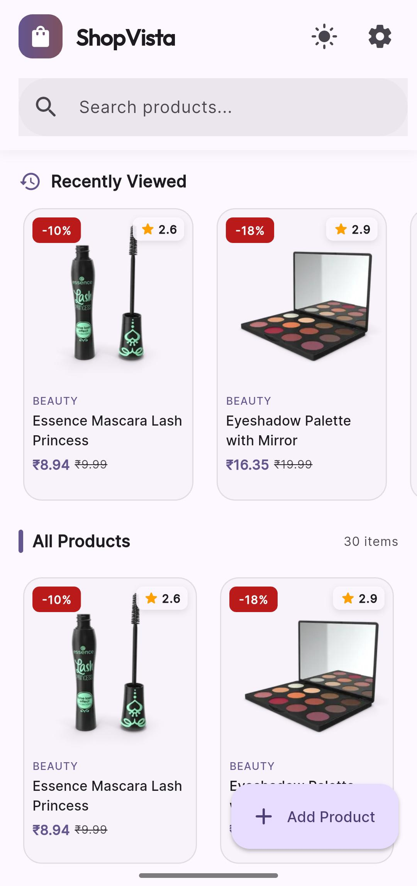
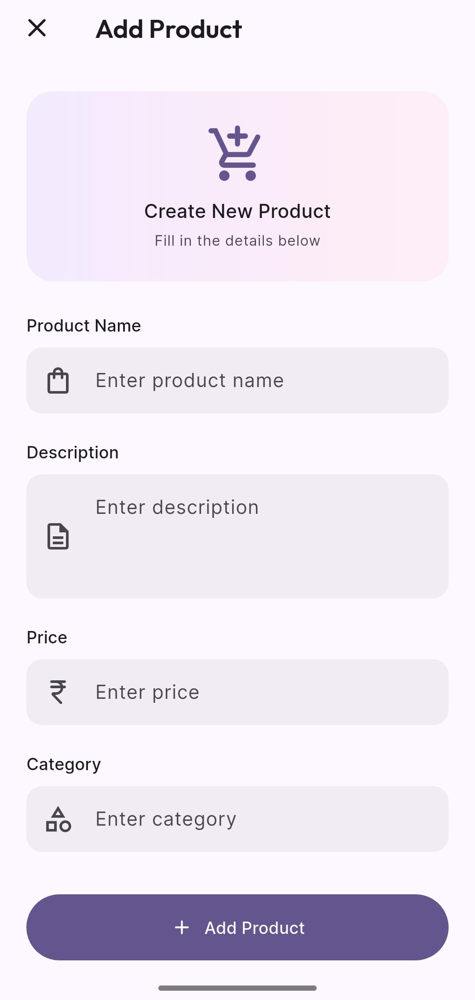
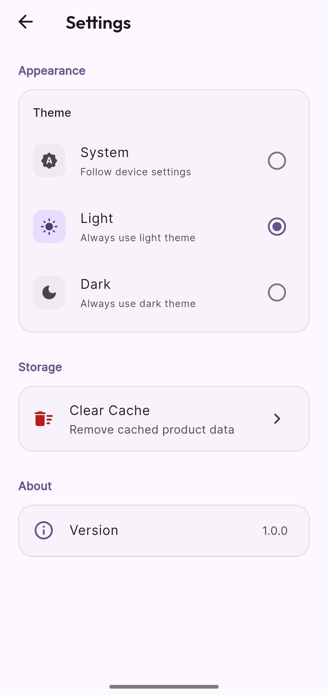
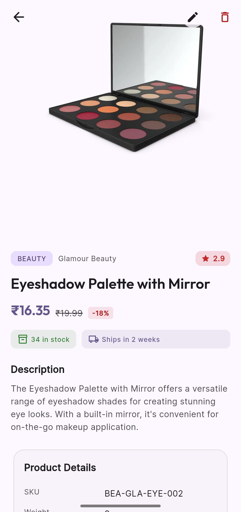
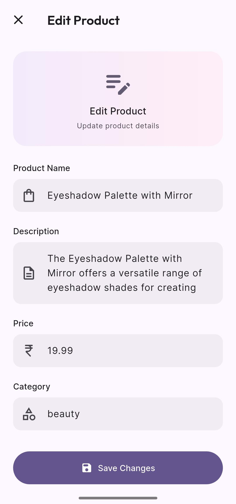
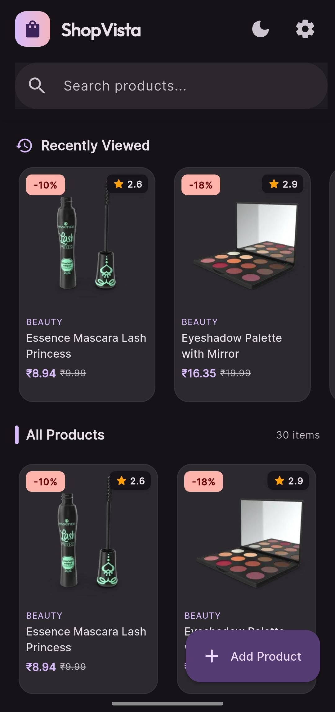

<!-- <p align="center">
  
</p> -->

<h1 align="center">ShopVista — Product Management App</h1>

<p align="center">
  A Flutter application for managing products with offline support, theme switching, and a clean user interface built using Material 3.
</p>

<p align="center">
  
  
  
  
</p>

---

## Table of Contents

- [About the Project](#about-the-project)
- [Screenshots](#screenshots)
- [Setup Instructions](#setup-instructions)
- [Architecture Explanation](#architecture-explanation)
- [Features Walkthrough](#features-walkthrough)
- [Packages Used](#packages-used)
- [Testing](#testing)
- [Assumptions](#assumptions)

---

## About the Project

ShopVista is a product management application that I built using Flutter. The idea was to create something that feels polished and production-ready — not just a basic CRUD app, but one that handles real-world scenarios like going offline, caching data, and letting users personalise their theme.

The app connects to the [DummyJSON API](https://dummyjson.com) for product data and supports the full range of operations: browsing, searching, adding, editing, and deleting products. I focused on keeping the code modular and testable by following Clean Architecture principles with MVVM on the presentation layer.

---

## Screenshots


<p align="center">
  
  
  
  
  
  

</p>

 **Note:** Add your screenshots to the `screenshots/` folder and uncomment the section above. Recommended screenshots: Home (Light), Home (Dark), Product Detail, Add Product, Settings, Search, Offline Banner.

---

## Setup Instructions

### Prerequisites

Before running the project, make sure you have the following installed:

- **Flutter SDK** — Version **3.41.6** (Stable Channel) or later
- **Dart** — Version **3.11.4** or later (bundled with Flutter)
- An emulator or physical device connected
- Git (for cloning the repository)

You can verify your setup by running:

```bash
flutter doctor
```

### Installation Steps

1. **Clone the repository**

```bash
git clone <repository-url>
cd product_management_app
```

2. **Install dependencies**

```bash
flutter pub get
```

3. **Generate serialization code**

The project uses `json_serializable` for model parsing. You need to run the code generator once after cloning:

```bash
dart run build_runner build --delete-conflicting-outputs
```

This generates the `.g.dart` files for all model classes.

4. **Verify the setup** (optional but recommended)

```bash
flutter analyze
```

This should report no issues.

### Running the Application

```bash
# Run on a connected device or emulator
flutter run

# Or specify the platform
flutter run -d chrome     # for web
flutter run -d windows    # for Windows desktop
flutter run -d <device>   # for a specific device
```

### Running Tests

```bash
flutter test
```

---

## Architecture Explanation

### Folder Structure

I organised the project following **Clean Architecture** with a feature-first structure. The idea is that each feature is self-contained — it has its own data layer, domain logic, and UI. This makes the codebase easier to navigate and maintain as it grows.

```
lib/
├── core/                          # Shared foundation
│   ├── constants/
│   │   ├── api_constants.dart       # Base URL and endpoint paths
│   │   └── app_constants.dart       # App-wide strings, keys, limits
│   ├── errors/
│   │   ├── api_result.dart          # Sealed class: Success | Failure
│   │   └── failure.dart             # Generic failure model
│   ├── network/
│   │   ├── api_client.dart          # Reusable HTTP client (GET/POST/PUT/DELETE)
│   │   ├── api_endpoints.dart       # URL builder utility
│   │   ├── dio_provider.dart        # Dio instance with interceptors
│   │   └── network_exceptions.dart  # Typed exceptions (timeout, 404, etc.)
│   └── theme/
│       └── app_theme.dart           # Material 3 light and dark themes
│
├── features/
│   ├── products/                  # Main feature module
│   │   ├── data/
│   │   │   ├── datasource/
│   │   │   │   ├── product_remote_datasource.dart       # Abstract interface
│   │   │   │   ├── product_remote_datasource_impl.dart  # API implementation
│   │   │   │   └── product_local_datasource.dart        # Cache operations
│   │   │   ├── models/
│   │   │   │   ├── product_model.dart        # Main product model
│   │   │   │   ├── dimensions_model.dart     # Product dimensions
│   │   │   │   ├── review_model.dart         # Customer review
│   │   │   │   └── meta_model.dart           # Product metadata
│   │   │   └── repository/
│   │   │       └── product_repository_impl.dart  # Coordinates remote + local
│   │   ├── domain/
│   │   │   ├── repository/
│   │   │   │   └── product_repository.dart   # Abstract contract
│   │   │   └── usecases/
│   │   │       └── product_usecases.dart     # Individual business actions
│   │   └── presentation/
│   │       ├── providers/
│   │       │   └── product_providers.dart    # Riverpod state notifiers
│   │       └── screens/
│   │           ├── home_screen.dart          # Product grid + search
│   │           ├── product_detail_screen.dart
│   │           ├── add_product_screen.dart
│   │           └── edit_product_screen.dart
│   └── settings/
│       ├── settings_screen.dart    # Theme picker + cache controls
│       └── theme_provider.dart     # Theme state management
│
├── router/
│   └── app_router.dart            # GoRouter configuration
│
├── services/
│   ├── cache/
│   │   └── cache_service.dart     # Product caching + recently viewed
│   ├── connectivity/
│   │   └── connectivity_service.dart  # Online/offline detection
│   └── local_storage/
│       └── local_storage_service.dart # SharedPreferences provider
│
├── shared/
│   └── widgets/                   # Reusable UI components
│       ├── product_card.dart        # Grid product card
│       ├── product_carousel.dart    # Image slider for details
│       ├── price_widget.dart        # Price with discount display
│       ├── rating_badge.dart        # Star rating chip
│       ├── search_bar_widget.dart   # Styled search input
│       ├── theme_toggle.dart        # AppBar theme button
│       ├── offline_banner.dart      # Connectivity warning
│       ├── loading_widget.dart      # Shimmer loading skeleton
│       ├── error_widget.dart        # Error state with retry
│       └── empty_widget.dart        # Empty state illustration
│
└── main.dart                      # App entry point
```

### Why I Chose This Structure

- **core/** holds things that any feature might need — the network layer, theme config, constants. It doesn't depend on any feature.
- **features/** is where the actual screens live. Each feature follows the data → domain → presentation split, which keeps the API calls separate from the business rules and the UI.
- **services/** contains app-wide utilities like caching and connectivity that multiple features share.
- **shared/widgets/** has the reusable components I extracted so I'm not duplicating UI code across screens.

### State Management — Riverpod

I went with **Riverpod** for state management, and here's why it felt like the right fit for this project:

The biggest reason was **testability**. With Riverpod, I can create a `ProviderContainer`, override any dependency with a mock, and test my state logic in isolation — no widget tree needed. This made writing the unit tests for `ProductListNotifier` straightforward.

Another thing I appreciated was that Riverpod providers **don't need a BuildContext**. This means my business logic stays completely separate from the widget tree. The notifiers and use cases don't know anything about Flutter widgets — they just manage data. The UI simply watches the providers and rebuilds when the state changes.

It also helps with **dependency injection naturally**. Instead of setting up a separate DI container, Riverpod's `ref.watch` already handles that. When I need an API client in the repository, the repository provider just watches the API client provider. Dependencies flow naturally and are easy to swap out for testing.

The `StateNotifier` pattern gives me predictable state transitions — loading → success/error — which maps nicely to the different UI states (shimmer loading, error with retry, empty state, data grid).

### Local Storage Strategy

For local storage, I chose **SharedPreferences** because the data I'm persisting is relatively simple:

1. **Theme Preference** — The user's selected theme mode (system, light, or dark) is saved as a string key. When the app starts, it reads this value and sets the theme accordingly. If nothing is saved, it defaults to following the system theme.

2. **Cached Products** — When products are fetched from the API, I serialise the entire product list to JSON and store it in SharedPreferences. It's not the most efficient approach for large datasets, but for the scale of this app (30 products), it works well and keeps things simple. When the device goes offline, the app reads from this cache and shows the user their last-fetched data along with an offline banner.

3. **Recently Viewed** — Product IDs are stored in a JSON array, ordered by most recently viewed. I cap it at 10 items. When the user taps a product, the ID moves to the front of the list. The home screen reads this list and shows a horizontal scroll section of recently viewed products.

I considered Hive for this, but SharedPreferences was simpler to set up and sufficient for the amount of data being stored. If the app scaled to hundreds of products or needed to cache images, I'd switch to Hive or Isar.

---

## Features Walkthrough

### Product List

The home screen shows products in a responsive 2-column grid. Each card displays the product image, name, category, price in ₹ (Indian Rupees), rating, and discount badge. The list supports **pull-to-refresh** to reload from the API.

I handle three distinct UI states:
- **Loading** — Shows shimmer skeleton placeholders while the API call is in progress
- **Error** — Displays the error message with a retry button
- **Empty** — Shows an illustration with a message when no products exist

### Search

Search uses the DummyJSON search endpoint. I implemented a **500ms debounce** so the API isn't hit on every keystroke — it waits for the user to stop typing before making the call. The search has its own loading indicator and shows a friendly message when there are no results.

### Product Details

The detail screen uses a **SliverAppBar** with a hero animation from the product card. Images are displayed in a carousel (using `carousel_slider`) with dot indicators. Below that, I show the full product info: category, brand, price with discount, stock status, shipping info, product dimensions, and customer reviews.

### Add & Edit Product

Both forms use Flutter's built-in form validation. The fields are:
- **Product Name** — required
- **Description** — required
- **Price** — required, must be a valid number
- **Category** — required

The edit screen pre-fills all fields with the existing product data. After a successful API call, the product list updates locally so the user sees the change immediately without needing to refresh.

### Delete Product

Tapping the delete button shows a confirmation dialog. If confirmed, the product is removed via the API and deleted from the local state simultaneously, so the UI updates right away.

### Theme Switching

The app supports three theme modes:
- **System** — Follows the device's dark/light setting automatically
- **Light** — Always light
- **Dark** — Always dark

The selected mode is persisted in SharedPreferences. Users can change it from the Settings screen (radio-style selector) or cycle through modes using the icon button in the app bar.

### Offline Support

The app uses `connectivity_plus` to monitor the network state in real time. When the connection drops:
- A coloured banner appears at the top of the screen saying "You are offline"
- The app loads products from the local cache instead
- When the connection comes back, the banner disappears

If there's no cached data and no connection, the error state shows with a message explaining the situation.

---

## Packages Used

| Package | Version | What I Used It For |
|---|---|---|
| `flutter_riverpod` | ^2.6.1 | State management and dependency injection |
| `dio` | ^5.7.0 | HTTP networking with interceptors and timeout config |
| `go_router` | ^14.8.1 | Navigation with named routes and transition animations |
| `shared_preferences` | ^2.3.4 | Persisting theme, cached products, and recently viewed |
| `connectivity_plus` | ^6.1.1 | Detecting online/offline status |
| `cached_network_image` | ^3.4.1 | Loading and caching product images |
| `json_annotation` | ^4.9.0 | Model annotations for code generation |
| `json_serializable` | ^6.9.4 | Generating fromJson/toJson methods |
| `build_runner` | ^2.4.14 | Running the code generator |
| `carousel_slider` | ^5.0.0 | Product image carousel on the detail screen |
| `google_fonts` | ^6.2.1 | Outfit and Inter typefaces for Material 3 typography |
| `shimmer` | ^3.0.0 | Loading skeleton animations |
| `mocktail` | ^1.0.5 | Creating mock classes for unit and widget tests |

---

## Testing

I wrote tests covering the key layers of the architecture:

### Unit Tests

| Test File | What It Verifies |
|---|---|
| `product_repository_impl_test.dart` | The repository fetches products from the remote datasource and caches them locally. Uses mocked datasources. |
| `product_list_notifier_test.dart` | The state notifier correctly updates its state (loading → loaded) when products are fetched. Verifies connectivity check and API call flow. |

### Widget Tests

| Test File | What It Verifies |
|---|---|
| `home_screen_test.dart` | The home screen renders `ProductCard` widgets when the state has products. Verifies product name and price are displayed. |
| `add_product_screen_test.dart` | Form validation works correctly — shows "required" errors when submitting empty, and "must be numeric" when price field has text. |

### Running the tests

```bash
# Run all tests
flutter test

# Run a specific test file
flutter test test/features/products/data/repository/product_repository_impl_test.dart

# Run with verbose output
flutter test --reporter expanded
```

---

## Assumptions

Here are the assumptions I made while building this app:

1. **DummyJSON is a mock API** — The add, edit, and delete endpoints on DummyJSON don't actually persist changes on the server. So after adding or updating a product, I update the local state immediately to give the user visual feedback. The API confirms the operation was accepted, but the data resets on the next fetch.

2. **Product prices are displayed in INR (₹)** — I chose Indian Rupees as the currency symbol throughout the app. The actual price values come from the API as-is (no currency conversion is applied).

3. **SharedPreferences is sufficient for caching** — Given the scale of the app (around 30 products), storing the product list as a JSON string in SharedPreferences is practical. For a production app with thousands of products, I'd use a database like Hive, Isar, or SQLite.

4. **Offline mode shows last-fetched data** — When the device is offline, the app shows whatever was cached from the most recent successful API call. It doesn't attempt background sync or retry logic — it simply displays what's available and shows an offline indicator.

5. **Search only works online** — Since search relies on the DummyJSON search API endpoint, it requires an active internet connection. Offline search against cached data is not implemented.

6. **Image caching is handled by the package** — I rely on `cached_network_image` for image caching. The images are cached on disk by the package itself and will be available offline if they were loaded previously.

7. **Theme defaults to system** — If the user hasn't manually selected a theme, the app follows the device's system-level dark/light mode setting.

8. **Recently viewed is capped at 10** — I limited the recently viewed list to 10 product IDs. This keeps the stored data small and the UI section manageable.

9. **No authentication** — The DummyJSON products API doesn't require authentication, so no login flow or token management is implemented.

10. **Minimum viable validation on forms** — The add/edit forms validate that fields are non-empty and that the price is numeric. More granular validations (like price range, category from a dropdown, image upload) are outside the current scope.

---

## API Reference

The app uses the [DummyJSON](https://dummyjson.com) Products API:

| Method | Endpoint | Description |
|---|---|---|
| `GET` | `/products` | Fetch all products (with pagination) |
| `GET` | `/products/{id}` | Fetch a single product |
| `GET` | `/products/search?q={query}` | Search products by name |
| `POST` | `/products/add` | Add a new product |
| `PUT` | `/products/{id}` | Update an existing product |
| `DELETE` | `/products/{id}` | Delete a product |

Base URL: `https://dummyjson.com`

---


